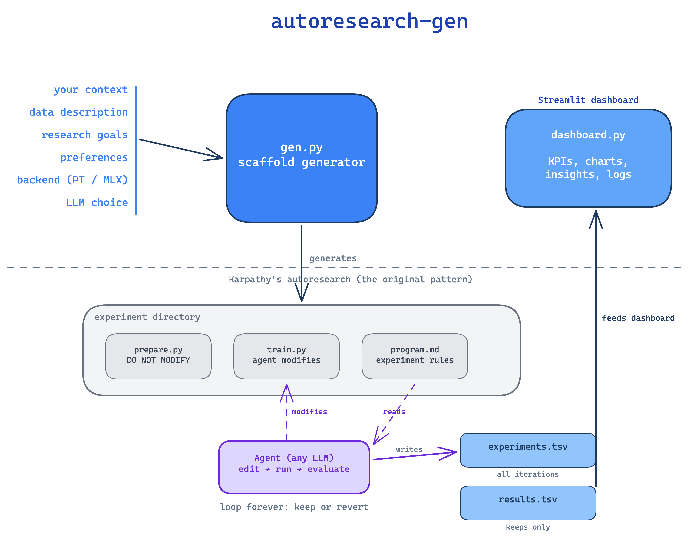
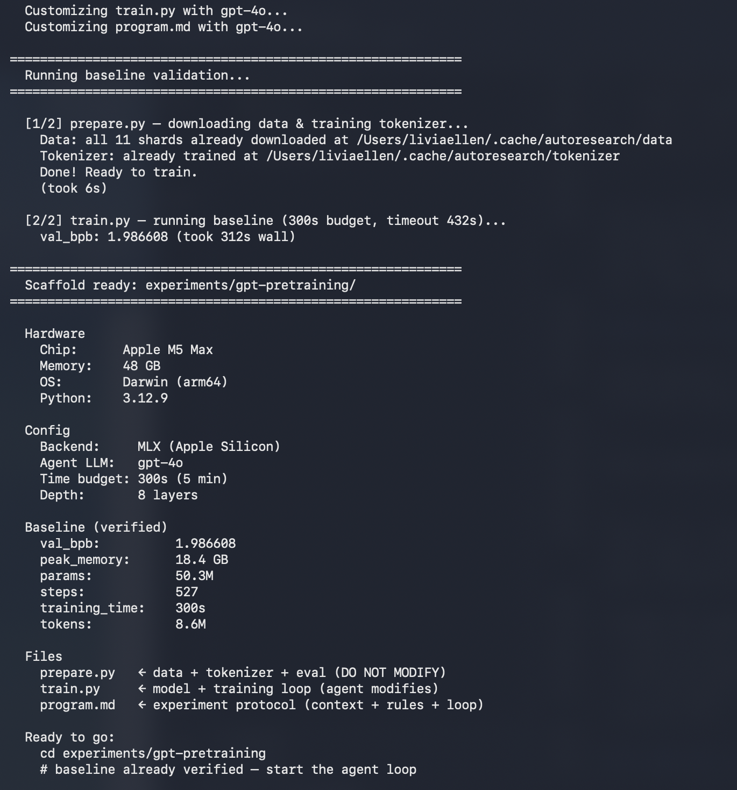

# autoresearch-gen

I loved Karpathy's [autoresearch](https://github.com/karpathy/autoresearch) — point an agent at a codebase and let it run experiments overnight. But every time I wanted to start a new experiment, I was manually editing `program.md`, copy-pasting train scripts, and losing context between runs.

So I built this. **autoresearch-gen** is a scaffold generator that sits on top of autoresearch. Tell it what you're working on, pick your LLM and backend, and it generates a ready-to-run experiment directory — then **automatically runs the baseline** to guarantee the code works before you hand it off to an agent.

Every scaffold is **verified end-to-end**: gen.py writes the files, runs `prepare.py` (downloads data, trains tokenizer), runs `train.py` (full training loop), parses the val_bpb, and prints a summary with your hardware info, config, and baseline results. If LLM-customized code crashes, it automatically falls back to the base template and re-runs. You never get a broken scaffold.

Before generating, the tool runs an **LLM-powered interview** — it reads what you told it, figures out what's missing or vague, and asks targeted follow-up questions. Then it calls your chosen LLM to tailor `train.py` and `program.md` based on everything you said.

Supports **PyTorch (CUDA)** and **MLX (Apple Silicon)**. Comes with a **Streamlit dashboard** to visualize any experiment's results.



## What happens when you run gen.py

```
1. Gather context      ← interactive prompts or --flags
2. LLM interview       ← asks follow-ups to fill gaps (optional)
3. Generate scaffold   ← writes prepare.py, train.py, program.md, pyproject.toml
4. Run prepare.py      ← downloads data shards, trains BPE tokenizer
5. Run train.py        ← full baseline training, parses val_bpb
6. Print summary       ← hardware, config, verified baseline metrics
```

If step 5 fails (LLM-customized code crashes), gen.py automatically falls back to the base template and re-runs. You always get a working scaffold.



The `program.md` captures everything you told the generator — project context, data, goals, preferences — so the agent knows *why* it's running experiments, not just how.

## Prerequisites

Just [uv](https://docs.astral.sh/uv/). It handles Python, virtual envs, and all dependencies per experiment — nothing else to install.

```bash
curl -LsSf https://astral.sh/uv/install.sh | sh
```

- **Mac (Apple Silicon):** auto-detects `--backend mlx`
- **GPU (CUDA):** pass `--backend pt`
- **No flag?** picks `mlx` on Apple Silicon, `pt` everywhere else

## Quick start

```bash
# Interactive — walks you through it
python gen.py

# Or one-shot with flags
python gen.py --output-dir experiments/mar11 --backend mlx
```

Both modes collect your project context, run the LLM interview, generate the scaffold, and **run the baseline automatically**. Use `--no-interview` to skip follow-ups. Use `--no-llm` to skip LLM customization entirely.

## How the interview works

Most scaffold generators take your input at face value. If you say "not sure", that's what gets baked into the template. autoresearch-gen does something different — it uses your chosen LLM to interview you before generating anything.

The flow is: **gather context → interview → generate scaffold**.

1. You provide initial context (interactively or via flags like `--context`, `--data`, `--goals`, `--prefs`)
2. The LLM reads everything you said, spots what's missing or vague, and asks 2-4 targeted follow-up questions
3. You answer (or type `done` to skip)
4. Up to 2 rounds — the LLM decides if it has enough info or needs to ask more
5. Your answers get folded into the context, then the LLM generates `train.py` and `program.md`

For example, if you pass `--context "Pretraining on M5 Max, not sure what architecture to use"`, the interview might ask:

```
1. What model size are you targeting? (e.g. 25M, 125M, 350M params)
2. Preferred attention mechanism? (standard MHA, GQA, sliding window?)
3. Sequence length for your data?
4. Any learning rate range to start with?
```

Your answers directly shape the generated code — the LLM uses them to pick architecture, hyperparameters, and experiment suggestions that fit your setup.

## Makefile

All common tasks are available via `make`:

```bash
make help                # show all targets
make gen                 # interactive scaffold generation
make dashboard           # launch Streamlit dashboard
make diagram EXP=experiments/my-run   # generate Excalidraw diagram
make baseline EXP=experiments/my-run  # run baseline manually
make agent EXP=experiments/my-run     # launch Claude agent
```

Pass `CONTEXT`/`DATA`/`GOALS` to skip interactive mode:

```bash
make gen EXP=experiments/mar12 \
  CONTEXT="Small GPT pretraining on M5 Max" \
  DATA="climbmix-400b-shuffle" \
  GOALS="Minimize val_bpb"
```

## Experiment diagrams

Generate an [Excalidraw](https://excalidraw.com) architecture diagram for any experiment. The script reads `train.py`, `results.tsv`, and `experiments.tsv` to build a visual showing model architecture, training config, results, and the agent loop.

```bash
# Generate diagram for an experiment
python excalidraw_gen.py experiments/my-run

# Or with make
make diagram EXP=experiments/my-run

# Custom output path
python excalidraw_gen.py experiments/my-run -o diagrams/my-run.excalidraw
```

The generated `.excalidraw` file can be opened at [excalidraw.com](https://excalidraw.com) (File → Open) or in VS Code with the Excalidraw extension.

## Dashboard

Streamlit dashboard to visualize experiment results. Auto-detects any metric from the TSV columns, figures out direction (lower/higher is better), and shows status.

```bash
# Launch — auto-discovers all experiments in experiments/
make dashboard

# Or point at a specific experiment
make dashboard-exp EXP=experiments/scaling-depth
```

What you get:
- **KPI cards** — best metric, baseline, improvement %, keep rate
- **Metric progression** — interactive chart with keep/revert markers
- **Best-so-far line** — running best across experiments
- **Status distribution** — pie chart of keep/revert/baseline
- **Overfitting analysis** — train vs eval gap (when available)
- **Auto-generated insights** — biggest win, worst attempt, diminishing returns
- **Full experiment log** — filterable table with highlighted best values

Works with any metric — val_bpb, cv_rmse, f1, accuracy, whatever your experiment tracks. The agent writes two TSV files: `experiments.tsv` (every iteration including reverts/crashes) and `results.tsv` (only baseline + kept experiments). The dashboard reads both.

## Examples

All examples run on Mac M5 Max (48GB, 40-core GPU) with MLX. Backend and model are auto-detected from your hardware and `.env` — no need to specify them.

### Just describe what you want

**Example 1: Just make it good**

```bash
python gen.py \
  --output-dir experiments/small-gpt \
  --context "New to LLM pretraining. M5 Max 48GB, 40-core GPU. \
Just want to see how good a small model can get." \
  --data "climbmix-400b-shuffle from HuggingFace" \
  --goals "Lowest val_bpb possible. Try whatever helps."
```

**Example 2: Attention-free architectures**

```bash
python gen.py \
  --output-dir experiments/attention-free \
  --context "Exploring attention-free LLM architectures on M5 Max 48GB. \
Interested in RWKV-style, state space models, or linear attention." \
  --data "climbmix-400b-shuffle from HuggingFace" \
  --goals "Lowest val_bpb without any softmax attention. Compare against transformer baseline."
```

**Example 3: Tiny model, max throughput**

```bash
python gen.py \
  --output-dir experiments/tiny-fast \
  --context "How fast can we train a tiny LLM on M5 Max 48GB? \
Optimize for tokens/sec, not model quality." \
  --data "climbmix-400b-shuffle from HuggingFace" \
  --goals "Maximize tokens/sec while keeping val_bpb under 2.0. \
Try very small models (4 layers, narrow), large batch sizes, fewer steps."
```

The LLM interview proposes concrete suggestions for architecture and hyperparameters. Hit Enter to accept or type changes.

### Full control

You know your setup, you have a hypothesis — use all the flags.

**Example 4: Scale model depth**

```bash
python gen.py \
  --output-dir experiments/scaling-depth \
  --backend mlx \
  --model claude-sonnet-4-20250514 \
  --context "How deep can we scale a GPT on M5 Max (48GB, 40-core GPU)? \
Start small, push model size aggressively." \
  --data "climbmix-400b-shuffle from HuggingFace, 10 shards" \
  --goals "Minimize val_bpb. Find the largest model that trains in 5 min on 48GB." \
  --prefs "Start with 4 layers. Try depths 4, 8, 12, 16, 20. \
Also try wider models. Stay under 40GB memory." \
  --depth 4
```

**Example 5: LR schedule ablation**

```bash
python gen.py \
  --output-dir experiments/lr-ablation \
  --backend mlx \
  --model claude-sonnet-4-20250514 \
  --context "Systematic LR schedule ablation on M5 Max. \
Fixed 8-layer GPT, only changing LR code." \
  --data "climbmix-400b-shuffle from HuggingFace, 10 shards" \
  --goals "Find the LR schedule that minimizes val_bpb. \
Try cosine, linear, constant, cyclic, 1cycle. Keep architecture frozen." \
  --prefs "Do NOT change model architecture. Only modify LR code. \
Try at least 10 variants." \
  --depth 8
```

### Running an experiment

```bash
# 1. Generate scaffold + run baseline (all automatic)
python gen.py --output-dir experiments/my-run --backend mlx

# 2. Point your agent at the verified scaffold
cd experiments/my-run
# In Claude Code:
#   "Read program.md and let's kick off a new experiment. Do the setup first."

# 3. Watch results in another terminal
streamlit run ../../dashboard.py
```

No manual `prepare.py` or `train.py` — gen.py runs both and verifies the baseline before you start.

## Use cases

### Overnight research on your Mac

I run this on my M5 Max (48GB unified memory, 40-core GPU). Each experiment takes ~5 minutes, so you get ~12 experiments per hour.

```bash
python gen.py \
  --output-dir experiments/overnight \
  --backend mlx \
  --model claude-sonnet-4-20250514 \
  --context "Small GPT pretraining on M5 Max (48GB, 40-core GPU)" \
  --data "climbmix-400b-shuffle, 10 shards" \
  --goals "Minimize val_bpb. Try different model sizes, LR schedules, and activations"
```

gen.py runs the baseline automatically — you'll see the hardware summary and verified val_bpb before the agent starts. Wake up to ~100 experiments completed. The agent logs every iteration to `experiments.tsv` and curated keeps to `results.tsv`. View them with `streamlit run dashboard.py`.

#### How to kick it off in Claude Code

After gen.py finishes and prints the verified baseline, `cd` into the experiment directory and launch Claude Code with permissions disabled (so it never blocks waiting for approval):

```bash
cd experiments/my-run
claude --dangerously-skip-permissions
```

Then paste:

```
Read program.md and start the experiment loop. Never stop.
```

`program.md` has all the rules — what to modify, how to run, how to log, when to keep or revert. The agent reads it and starts looping autonomously. Each iteration takes ~5 minutes on Apple Silicon.

**Tips for overnight runs:**
- Plug in your laptop and disable sleep (`caffeinate -i` in another terminal)
- Open the dashboard in a browser tab: `streamlit run ../../dashboard.py`
- If the agent crashes mid-loop, paste the same prompt again — it picks up from `results.tsv`

### CUDA box with OpenAI agent

```bash
python gen.py \
  --output-dir experiments/h100-run \
  --backend pt \
  --model gpt-4o \
  --api-key sk-... \
  --context "8-layer GPT on H100 80GB" \
  --data "climbmix-400b, full dataset" \
  --goals "Lowest val_bpb possible"
```

### Compare LLM agents

```bash
# Same experiment, different researchers
python gen.py --output-dir experiments/claude-run --model claude-sonnet-4-20250514 \
  --context "Free exploration on M5 Max" --goals "Lowest val_bpb possible"

python gen.py --output-dir experiments/gpt4o-run --model gpt-4o --api-key sk-... \
  --context "Free exploration on M5 Max" --goals "Lowest val_bpb possible"
```

Compare in the dashboard — it auto-discovers all experiments.

### Interactive — just exploring

```bash
python gen.py
```

Walks you through everything step by step — project context, data, goals, preferences, then the LLM interview asks follow-ups before generating your scaffold.

## Configuration

Copy `.env.example` to `.env` and fill in your values:

```bash
cp .env.example .env
```

```env
# Set your default model — used when --model is not passed
DEFAULT_MODEL=claude-sonnet-4-20250514

# Only the key for your chosen provider is required
ANTHROPIC_API_KEY=sk-ant-...
OPENAI_API_KEY=sk-...
DEEPSEEK_API_KEY=sk-...
```

The `.env` is loaded automatically at startup (no dependencies needed). Existing env vars take precedence — `.env` won't overwrite them. If no key is found via `--api-key` or env var, you'll be prompted interactively.

## Switching LLMs

The `--model` flag accepts any model ID. API keys are auto-routed by provider:

| Model contains | Env var |
|---|---|
| `claude` or `anthropic` | `ANTHROPIC_API_KEY` |
| `deepseek` | `DEEPSEEK_API_KEY` |
| `gpt`, `o1`, `o3`, etc. | `OPENAI_API_KEY` |

```bash
# Anthropic
python gen.py --output-dir exp/run1 --model claude-sonnet-4-20250514

# OpenAI
python gen.py --output-dir exp/run1 --model gpt-4o

# DeepSeek
python gen.py --output-dir exp/run1 --model deepseek-r1

# Or pass key directly
python gen.py --output-dir exp/run1 --model gpt-4o --api-key sk-...
```

With `DEFAULT_MODEL` set in `.env`, you can skip `--model` entirely:

```bash
# Uses whatever DEFAULT_MODEL is set to
python gen.py --output-dir exp/run1 --backend mlx --context "..." --goals "..."
```

### LiteLLM proxy

Route all LLM calls through a [LiteLLM proxy](https://docs.litellm.ai/docs/proxy/quick_start) — use any model from any provider (Ollama, Bedrock, Vertex, local models, etc.) with a single endpoint.

```env
# In .env
LITELLM_API_BASE=http://localhost:4000
LITELLM_API_KEY=sk-litellm-...    # optional for local proxies
```

When `LITELLM_API_BASE` is set, all LLM calls go through it using the OpenAI-compatible format. Any model ID works:

```bash
python gen.py --output-dir exp/run1 --model ollama/llama3
python gen.py --output-dir exp/run1 --model bedrock/claude-3-haiku
python gen.py --output-dir exp/run1 --model together_ai/meta-llama/Llama-3-70b
```

## All flags

```
python gen.py [OPTIONS]

Options:
  --output-dir DIR      Output directory (if omitted, goes interactive)
  --backend {pt,mlx}    Training backend (default: auto-detect)
  --tag TAG             Experiment tag (default: dir name)
  --model MODEL         LLM model ID (default: $DEFAULT_MODEL or claude-sonnet-4-20250514)
  --api-key KEY         API key for the LLM
  --time-budget SECS    Training time budget (default: 300)
  --depth N             Transformer layers (default: 8)
  --batch-size-pt N     Batch size for PyTorch (default: 64)
  --batch-size-mlx N    Batch size for MLX (default: 16)
  --context TEXT        Project context — what you're building
  --data TEXT           Data description — source, format, size
  --goals TEXT          Research goals — what to optimize
  --prefs TEXT          Scaffold preferences — starter code style
  --no-llm             Skip LLM customization, use base templates only
  --no-interview       Skip follow-up questions, go straight to scaffolding
```

## Project structure

```
gen.py              ← scaffold generator
templates/          ← prepare.py, train.py, program.md templates (PT + MLX)
excalidraw_gen.py   ← experiment diagram generator
dashboard.py        ← experiment tracking dashboard (Streamlit)
Makefile            ← common tasks (make help)
pyproject.toml      ← project deps
.env.example        ← config template (copy to .env)
experiments/        ← generated experiment directories
```

## What we add on top of Karpathy's autoresearch

[Karpathy's autoresearch](https://github.com/karpathy/autoresearch) is a single repo with one `prepare.py`, one `train.py`, and one `program.md`. You clone it and point your agent at it.

**autoresearch-gen** adds:

| | autoresearch | autoresearch-gen |
|---|---|---|
| Setup | Clone repo, manually edit `program.md`, run prepare + train yourself | Run `gen.py` — **auto-runs baseline**, prints hardware + verified metrics |
| Validation | Hope it works | **Guaranteed** — baseline runs before you touch the agent. LLM code crash? Auto-fallback to base template |
| Backend | PyTorch only | **PyTorch + MLX** (Apple Silicon) |
| Context | You write `program.md` by hand | **LLM-generated** — describe your project, LLM asks follow-ups, then customizes `train.py` + `program.md` |
| Agent LLM | Hardcoded | **Switch with `--model`** — Claude, GPT-4o, DeepSeek, or any model via LiteLLM |
| Logging | Single TSV | **Two TSVs** — `experiments.tsv` (all iterations) + `results.tsv` (keeps only) |
| Visualization | None | **Streamlit dashboard** — auto-detects metrics, shows progression, insights |
| Experiments | One at a time | **Experiment factory** — generate as many as you want, dashboard discovers all |

Think of it as:
- **autoresearch** = the experiment
- **autoresearch-gen** = the experiment factory + dashboard

## Roadmap

- **Memory / context layer** — persistent memory across experiment sessions so the agent remembers what worked, what failed, and why. Context carries over between runs — no more starting from scratch each time
- **Beat existing benchmarks** — reproduce and improve on results from recent pretraining research papers using the autonomous loop
- **Platform integrations** — support for Weights & Biases, MLflow, and other experiment tracking platforms alongside the built-in dashboard

## Attribution

Built on top of:

- [autoresearch](https://github.com/karpathy/autoresearch) by [@karpathy](https://github.com/karpathy) — the original autonomous pretraining research framework
- [autoresearch-mlx](https://github.com/karpathy/autoresearch/tree/master) — MLX backend for Apple Silicon, community-contributed

## Maintainer

[@liviaellen](https://github.com/liviaellen) at [Mem0](https://github.com/mem0ai) · [@ellen_in_sf](https://x.com/ellen_in_sf)

## License

MIT
